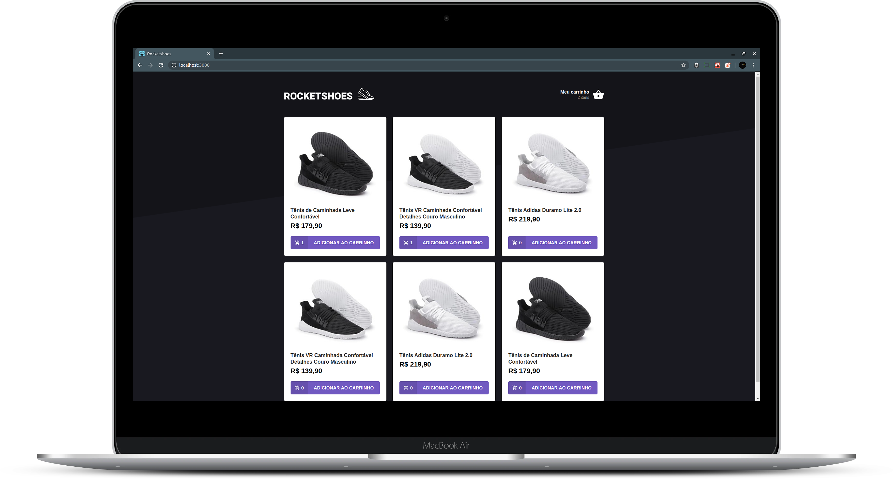

<h1 align="center">
    
</h1>

<blockquote align="center">“Great things never come from comfort zones.”</blockquote>

<p align="center">
  <a href="#bulb-about">About</a>&nbsp;&nbsp;&nbsp;|&nbsp;&nbsp;&nbsp;
  <a href="#computer-install">Install</a>&nbsp;&nbsp;&nbsp;|&nbsp;&nbsp;&nbsp;
  <a href="#boom-result">Result</a>&nbsp;&nbsp;&nbsp;|&nbsp;&nbsp;&nbsp;
  <a href="#memo-licença">License</a>
</p>

## :bulb: About

<p align="justify">React application to study redux and redux-saga, where we made a cart from a shoe store. Technologies used:</p>

- [React](https://reactjs.org/)
- [Redux](https://redux.js.org/)
- [Redux-Saga](https://redux-saga.js.org/)

<p align="justify">for code pattern i used:</p>

- [Eslint](https://eslint.org/)
- [Prettier](https://prettier.io/)

<p align="justify">and to debug errors:</p>

- [Reactotron](https://infinite.red/reactotron)

## :computer: Install

**Clone**
```
git clone https://github.com/victorvf/redux-react.git
```

**React**

```
- yarn install

- yarn start
```

**JSON Server**

```
- yarn json-server server.json -p 3001
```

## :boom: Result

<h3 align="center">
    
</h3>

## :memo: License

this project is under the MIT license. See the archive [LICENSE](https://github.com/Rocketseat/bootcamp-gostack-desafio-03/blob/master/LICENSE.md) for more details.
